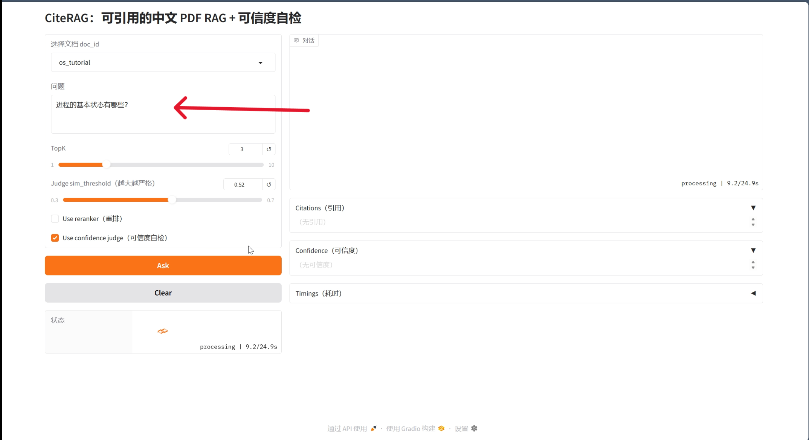
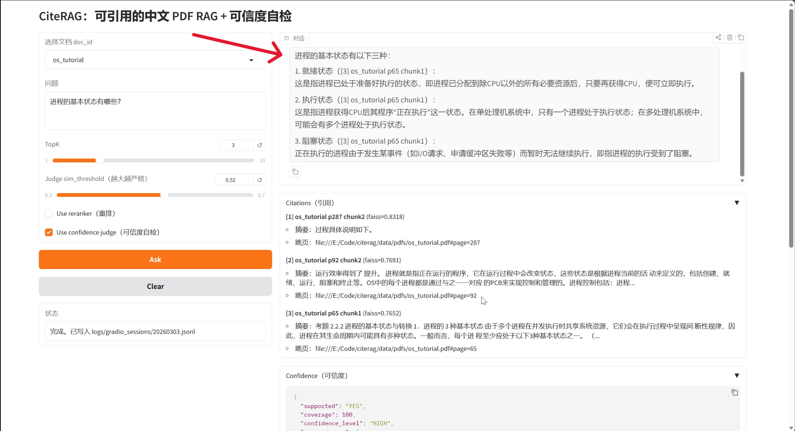
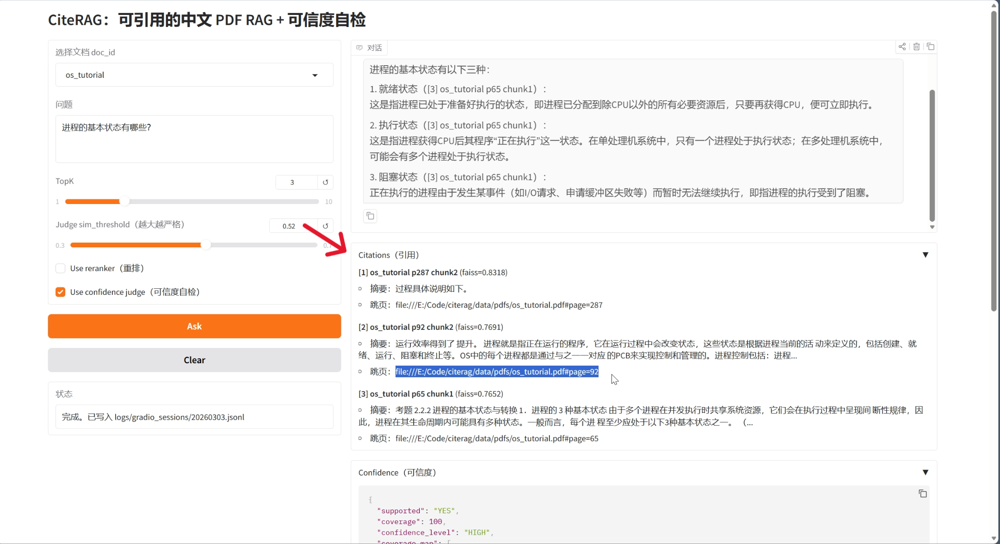
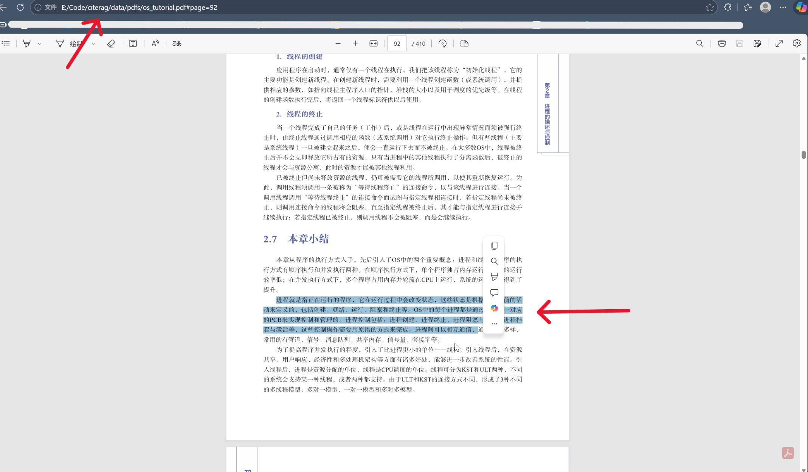

CiteRAG

一个支持 **引用证据** 的中文 PDF RAG 问答系统，并结合小样本 **QLoRA** 微调，探索其在 **操作系统** 与 **计算机组成原理** 教材问答场景下的效果。

---

# 1. 项目简介

CiteRAG 是一个面向中文教材场景的 PDF 问答系统。系统以课程 PDF 为知识来源，通过 **检索增强生成（RAG）** 回答用户问题，并在回答中给出可追溯的引用证据，例如：

- 文档来源
- 页码
- chunk 编号
- 证据片段

在完成基础 RAG 系统后，本项目进一步围绕 **操作系统 / 计算机组成原理** 两门课程，进行了 **小样本 QLoRA 微调实验**，用于分析：

- 小样本 LoRA 是否有助于教材风格适配
- response-only loss 监督对齐方式对结果的影响
- 数据纯净度对微调结果的影响
- LoRA 与 RAG 在实际问答系统中的互补关系

## 系统运行示例
* 提问

* 回答

* 引用

* 展示

# 2. 项目目标

## 2.1 系统目标

构建一个支持中文 PDF 检索问答的 CiteRAG 系统，实现：

- PDF 解析
- 文本 chunk 切分
- embedding 向量化
- FAISS 检索
- reranker 重排序
- LLM 回答生成
- 引用证据输出
- LLM judge 自检

---

## 2.2 研究目标

围绕操作系统 / 计组教材问答，探索：

- 小样本 QLoRA 是否提升回答风格一致性
- response-only loss 对齐方式对微调效果的影响
- 数据纯净度对模型输出质量的影响
- LoRA 在该场景下更适合做知识增强还是风格适配

---

# 3. 项目主要功能

当前 CiteRAG 已支持：

- 中文 PDF 文档解析
- 按 chunk 切分教材文本
- embedding 向量化
- FAISS 向量检索
- reranker 重排序
- LLM 回答生成
- 引用证据输出
- LLM judge 自检
- QLoRA 小样本微调
- Base vs LoRA 实验对比

---

# 4. 项目亮点

## 4.1 回答带引用证据

与普通问答系统不同，CiteRAG 在回答中会输出证据来源：

- doc_id
- page
- chunk_id
- snippet
- score

用户可以直接追溯答案来源。

---

## 4.2 完整 RAG pipeline

系统包含完整流程：

PDF → chunk → embedding → FAISS → reranker → LLM → 引用输出

---

## 4.3 引入 LLM Judge

系统会使用 LLM 对回答进行自检：

- coverage
- unsupported_points
- confidence

用于评估回答是否被证据支持。

---

## 4.4 小样本 QLoRA 实验

项目围绕以下问题进行了实验：

- response-only loss 对齐
- 数据纯净度影响
- clean50 vs clean100
- LoRA 在 RAG 系统中的定位

---

# 5. 项目结构

citerag/
├─ app.py
├─ data/
├─ docs/
├─ eval/
├─ finetune/
├─ index/
├─ outputs/
├─ reports/
├─ scripts/
├─ src/
└─ README.md

---

# 6. 实验环境

项目环境：

项目路径: E:\Code\citerag  
conda环境: my_project_citerag  
Python: D:\Anaconda\envs\my_project_citerag\python.exe  

模型：

Base model: Qwen2.5-3B-Instruct  
Embedding: bge-small-zh  
Vector DB: FAISS  

---

# 7. 环境安装

项目环境依赖如下：

- torch
- transformers
- accelerate
- datasets
- peft
- bitsandbytes
- sentence-transformers
- faiss-cpu
- pypdf

安装：

```bash
pip install -r requirements.txt
```

---

# 8. 快速开始

Step1 准备 PDF  
放入 data/pdfs/

Step2 解析 PDF  
python scripts/parse_pdf.py

Step3 切分 chunk  
python scripts/chunk_text.py

Step4 构建索引  
python scripts/build_faiss.py

Step5 运行 RAG  
python scripts/rag_answer.py

---

# 9. 脚本说明

scripts 目录包含数据处理、RAG推理、评测等脚本。

| 脚本 | 作用 |
|----|----|
| parse_pdf.py | 解析 PDF 文档 |
| chunk_text.py | 将文本切分为 chunk |
| build_faiss.py | 构建向量索引 |
| rag_answer.py | RAG 问答 |
| rag_with_confidence.py | 带可信度评估的 RAG |
| generate_sft_from_chunks_final.py | 从 chunk 构造 SFT 数据 |
| demo_citations.py | 引用输出示例 |

---

# 10. RAG 系统流程

PDF解析  
↓  
chunk切分  
↓  
embedding  
↓  
FAISS检索  
↓  
reranker  
↓  
LLM生成  
↓  
引用输出  
↓  
judge自检

---

# 11. 引用格式

doc_id  
page  
chunk_id  
snippet  
score  

---

# 12. 评测

问答评测：

python eval/run_eval.py

检索评测：

python eval/run_retrieval_eval.py

---

# 13. QLoRA 微调

训练模板：

你是一名计算机专业助教，请简洁回答问题。

问题：...  
回答：...

---

# 14. response-only loss 修正

labels = [-100]*len(prefix_ids) + answer_ids

仅监督回答部分。

---

# 15. 实验结果

实验版本：

Base  
LoRA-raw  
LoRA-alignfix  
LoRA-clean50  
LoRA-clean100

主要结论：

1. Base 复杂问题更完整  
2. LoRA 风格更教材化  
3. response-only 对齐关键  
4. 数据纯净度影响明显  
5. clean50 当前优于 clean100  

---

# 16. 当前结论

CiteRAG 实现了一个支持引用证据的中文 PDF RAG 系统，并探索了小样本 QLoRA 在教材问答中的效果。实验表明数据纯净度与 response-only 对齐对结果影响显著，LoRA 更适合作为领域风格适配器。

---

# 17. 局限

- 知识范围主要集中在 OS / 计组
- 3B 模型能力上限
- judge 机制仍可优化

---

# 17. 后续工作

- Base + RAG vs LoRA-clean50 + RAG
- 扩展更多课程 PDF
- 完善评测体系